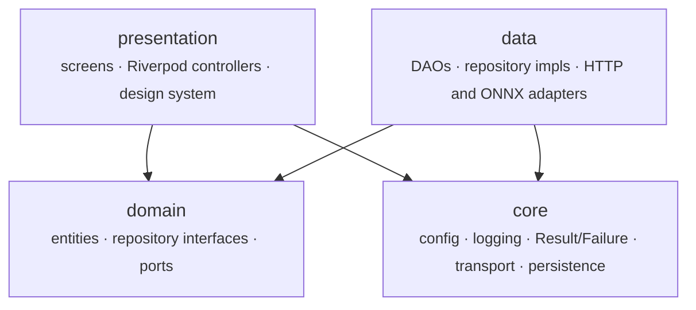
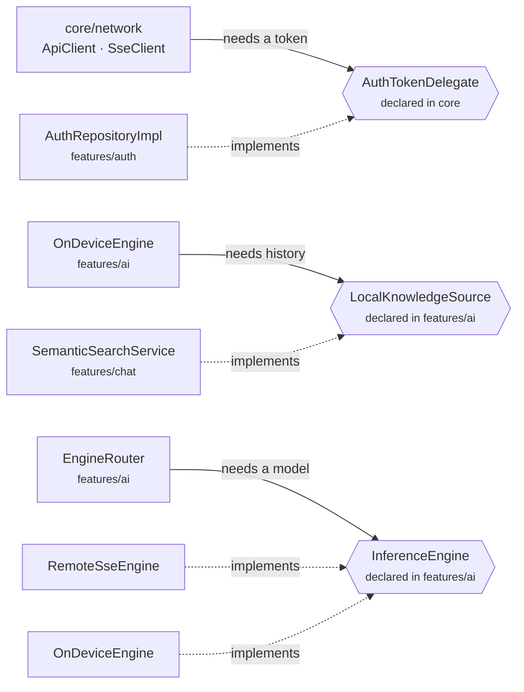
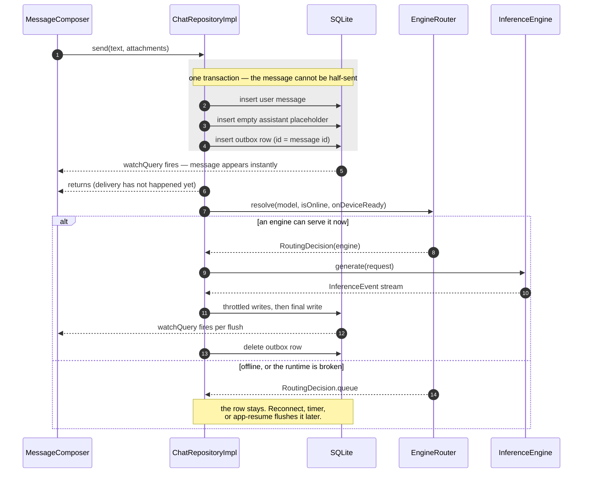
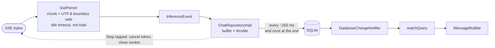
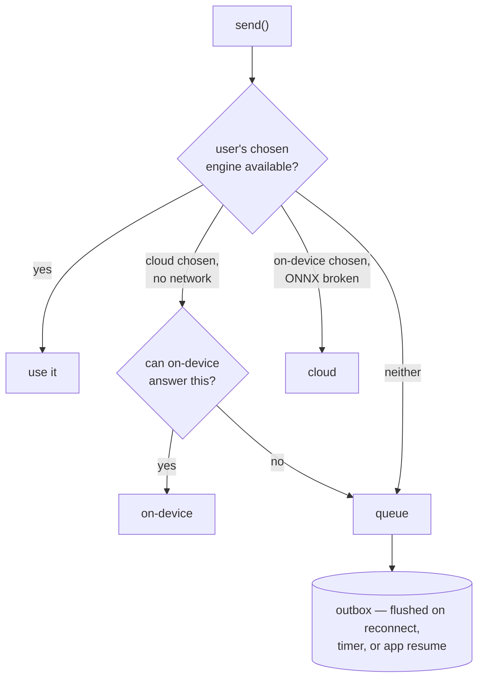
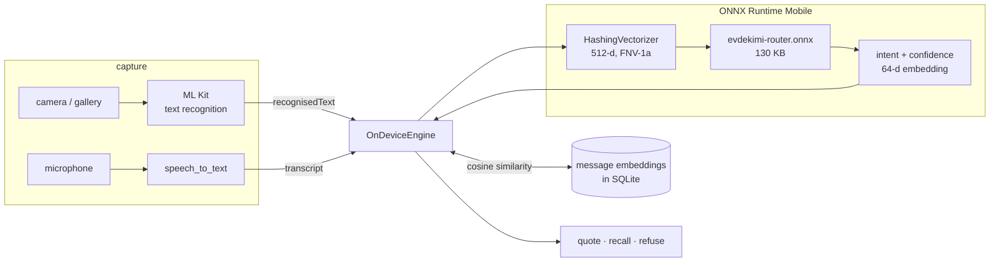

# Architecture at a glance

One page. The prose behind every decision here is in
[ARCHITECTURE.md](ARCHITECTURE.md); this is the shape.

Diagrams are Mermaid, so they render on GitHub, diff in review, and cannot go
stale in the way an exported PNG does.

---

## The dependency rule

Arrows point **in the direction of dependency**: `A ──▶ B` means A imports B.
Nothing points out of `core`, and nothing points from `domain` into `data`.



`domain` imports neither of the two layers that depend on it, and imports only
primitives from `core`. That is what makes it possible to unit-test the rules
without a database, a socket, or a widget tree.

## The three ports

The distinctive part, and the reason the arrows above never need to bend
backwards. Each port is **declared by the layer that needs the behaviour** and
**implemented by the layer that has it** — so both arrows point *at* the port,
and the dependency never inverts.



| Port | What the naïve version would have done |
|---|---|
| `AuthTokenDelegate` | The HTTP layer imports the auth feature to attach a bearer token. It would then know a `User` exists, and `core` would depend on a feature. |
| `LocalKnowledgeSource` | The AI layer imports the chat feature to search history. The analyzer caught this one as a genuine provider cycle, and the fix produced a smaller unit that is testable without a network stack. |
| `InferenceEngine` | Callers branch on "is this the local model or the cloud one". Instead both satisfy one contract and emit the same `InferenceEvent` stream, so nothing above the port knows which ran — and a future local LLM replaces one class. |

## What lives where

| Layer | Contents |
|---|---|
| `app/` | `HomeShell` · `FloatingNavBar` · go_router configuration |
| `presentation/` | Conversation list · Chat · Search · Settings · Auth · Log console |
| `design_system/` | `AppPalette` · tokens · `ChatTheme` · `GlassSurface` · shared widgets |
| `domain/` | `Conversation` · `Message` · `Attachment` · `AuthSession` · `AppSettings` · repository interfaces |
| `data/` | `ChatRepositoryImpl` · `ConversationDao` · `MessageDao` · `OutboxDao` · `ChatMappers` · `SemanticSearchService` · `AuthRepositoryImpl` · `EngineRouter` · `RemoteSseEngine` · `OnDeviceEngine` · `OnnxRouterModel` · `HashingVectorizer` · `AttachmentService` · `SpeechInputService` |
| `core/` | `AppConfig` · `AppLogger` · `Result`/`Failure` · `ErrorMapper` · `ApiClient` · `DioFactory` · auth/retry/logging interceptors · `SseClient` · `SseParser` · `AppDatabase` · `DatabaseChangeNotifier` · `SecureStore` · `KeyValueStore` · `MarkdownText` |
| `di/` | `providers.dart` — the composition root, and the only file that knows every concrete type |

Two external dependencies, both deliberate: `tools/mock_server.js` serves an
OpenAI-compatible `/chat/completions` over SSE, and a 130 KB ONNX model ships in
the app bundle.

---

## Sending a message

The spine of the app, and the reason there is no "offline mode" branch anywhere
in the codebase. **Three rows commit in one transaction, then delivery is
attempted and is allowed to fail.**



**Why the outbox id *is* the message id.** Enqueueing twice is a primary-key
conflict rather than a duplicate send, and the derived idempotency key travels
to the server so a retry after a lost response is recognised as the same write.

**Why connectivity is only a hint.** A captive-portal Wi-Fi reports "online"
while every request fails, so the outbox re-queues on the *request outcome*, not
on what `ConnectivityService` says. Connectivity only decides when to *try*.

---

## Streaming, and why the UI never reads the socket

The non-obvious property: **tokens never travel from the network to the screen.**
They go to the database, and the screen is watching the database. One source of
truth, and a crash mid-stream loses nothing that was already flushed.



`SseParser` is hand-written for three reasons a package would not have covered:
a token can be split across two TCP reads, a multi-byte UTF-8 character can be
split mid-sequence, and the useful failure signal is *"no bytes for N seconds"*
rather than a cap on the whole response — a model may legitimately think for
seconds between tokens.

---

## Which engine runs



Step 2 is the one with judgement in it. The local model answers a **narrow** set
of intents, so silently downgrading a question it cannot serve into a canned
refusal would be worse than queueing and answering properly a minute later.

---

## On-device AI, end to end

Everything here runs with the network off.



**It quotes rather than interprets, and says so.** Reading characters off an
image and understanding what they mean are different problems; only the first is
solved locally. A confidently wrong local answer would be worse than an honest
refusal, so the engine names the gap and points at the cloud model.

The Dart vectoriser and the Python that produced the training data are held
byte-identical by a golden fixture emitted from the training script itself, and
CI retrains the model to prove the committed weights are reproducible.

---

## Where the layers live

```
lib/
├── app/                 shell, router, floating dock
├── core/                config · logging · errors · Result
│   ├── network/         Dio, interceptors, SSE, AuthTokenDelegate
│   ├── persistence/     AppDatabase, secure + key-value stores
│   └── text/            markdown → plain text
├── design_system/       palette · tokens · ChatTheme · glass · widgets
├── di/                  providers.dart — the composition root
└── features/
    ├── ai/              InferenceEngine port, engines, ONNX
    ├── auth/            session, keystore, token refresh
    ├── chat/            conversations, messages, outbox, search
    ├── input/           OCR, dictation
    ├── settings/        preferences
    └── diagnostics/     in-app log console
```

`chat` does not import `auth`. `auth` does not import `chat`. Signing out needs
to wipe conversations, so `AuthRepositoryImpl` takes an `onSignedOut` callback
that `providers.dart` wires to the database — the coupling lives in the
composition root, where coupling belongs, instead of being baked into a feature.
